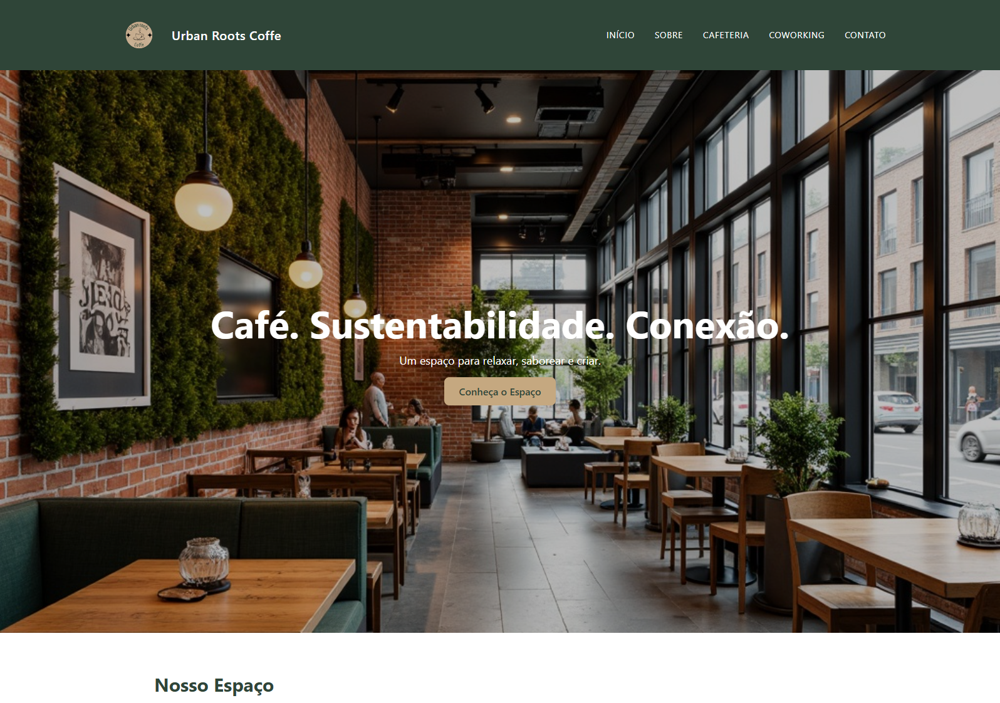
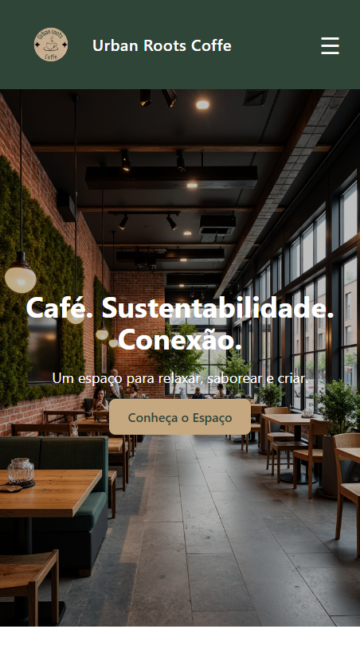

# ☕ Urban Roots Coffe

O **Urban Roots Coffe** é um projeto web fictício desenvolvido para representar uma cafeteria moderna e sustentável que une **trabalho, bem-estar e natureza**.  
A ideia é oferecer uma experiência digital que transmita o mesmo acolhimento, equilíbrio e estética que o ambiente físico da marca.

---

## 🎯 Objetivo

Criar um site institucional com design leve, responsivo e agradável, destacando:
- O propósito e valores da marca;
- A cafeteria e o espaço coworking;
- Um meio simples e direto de contato;
- Transições suaves entre páginas, transmitindo fluidez e sofisticação.

---

## 🧠 Conceito da Marca

A **Urban Roots Coffe** nasceu com a missão de unir sabor, sustentabilidade e comunidade.  
O design foi pensado para refletir essa essência, usando:
- **Paleta natural:** tons de verde, bege e branco gelo, remetendo à natureza e conforto.  
- **Tipografia moderna e limpa:** reforçando o equilíbrio entre urbano e orgânico.  
- **Layout minimalista:** priorizando a clareza e a experiência do usuário.

---

## 🧩 Estrutura do Projeto

```
src/
├── assets/           # Imagens e ícones
├── components/       # Componentes reutilizáveis (Header, Footer, Section, etc)
├── pages/            # Páginas principais (Home, About, Cafe, Coworking, Contact)
├── App.tsx           # Estrutura das rotas e animações
└── main.tsx          # Ponto de entrada do projeto
```

---

## ⚙️ Tecnologias Utilizadas

-   
  Biblioteca principal usada para construir a interface do usuário e seus componentes reutilizáveis.

-   
  Adiciona tipagem estática e maior segurança ao código, melhorando a manutenção e escalabilidade.

-   
  Responsável pela navegação entre páginas e gerenciamento das rotas da aplicação.

-   
  Biblioteca usada para criar transições e animações suaves entre páginas e elementos.

-   
  Framework CSS utilizado para o design responsivo e estilização consistente em todas as páginas.

-   
  Gerencia os formulários de forma leve, performática e simples dentro do React.  

---

## 🖼️ Prévia Visual

| Página | Demonstração |
|:-------|:--------------|
| 🏠 Início | Exibe uma introdução à cafeteria e seus diferenciais |
| ☕ Cafeteria | Mostra o ambiente, cardápio e conceito da marca |
| 💼 Coworking | Apresenta o espaço colaborativo e seus benefícios |
| 📖 Sobre | Explica missão, visão e valores da Urban Roots |
| 📬 Contato | Formulário funcional com design limpo e intuitivo |

---

## 🧭 Funcionalidades

- Navegação fluida entre páginas com animações suaves  
- Layout totalmente **responsivo** para desktop e mobile  
- Seções visuais com **destaques fotográficos e cores equilibradas**  
- Formulário de contato funcional (simulado com alerta de envio)  
- Estrutura semântica e organizada para fácil manutenção  

---

## 📱 Responsividade

O projeto foi projetado para se adaptar a qualquer tamanho de tela.  
Abaixo, um exemplo do comportamento visual entre desktop e mobile:

| Desktop | Mobile |
|:--------:|:--------:|
|  |  |

---

## 🚀 Como Executar o Projeto

1. Clone o repositório:
   ```bash
   git clone https://github.com/Guilherme-Henry-Dev/urban-roots-coffe.git
   ```
2. Acesse o diretório:
   ```bash
   cd urban-roots-coffe
   ```
3. Instale as dependências:
   ```bash
   npm install
   ```
4. Inicie o servidor local:
   ```bash
   npm run dev
   ```
5. Abra o navegador em:
   ```
   http://localhost:5173
   ```

---

## 📦 Status do Projeto

✅ **Concluído** – com potencial para expansão futura  
✨ Futuras melhorias:
- Integração real do formulário de contato  
- Página de cardápio com produtos dinâmicos  
- Área administrativa simples para gerenciamento de conteúdo  

---

## 👨‍💻 Autor

**Guilherme Henry**  
Designer Gráfico • Social Media • Front-End Developer  

📍 [LinkedIn](https://www.linkedin.com/in/guilhermehenryf)  
📸 [Instagram](https://www.instagram.com/guilhermeh_designer_)  
💼 [Portfólio](https://portifolio-guilherme-nu.vercel.app)  

---

## 🪴 Licença

Este projeto é de uso **educacional e demonstrativo**, criado com fins de portfólio.  
Todos os direitos reservados à marca fictícia **Urban Roots Coffe**.
